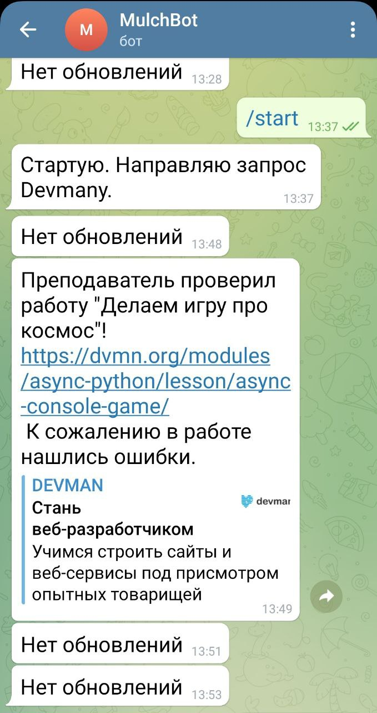

# Скрипт уведомлений о проверке работ на курсах Devman


## Настройки

Для запуска у вас уже должен быть установлен Python 3.

- Скачайте код
- Установите зависимости командой 
```
pip install -r requirements.txt
```
Создайте в корне скрипта (папка `Devman_API`) файл `.env` со следующимии настройками:  

`DEVMAN_TOKEN=ваш токен от Devman`, который можно увидеть на странице [API Девмана.](https://dvmn.org/api/docs/)  
Внимание! Вы должны войти на сайт под своими данными. 

`BOT_TOKEN=токен Вашего бота от Telegram`. [Инструкция, как создать бота.](https://core.telegram.org/bots/features#botfather)

`USER_ID=ваш личный ID от Telegram` (выглядит как 123456789). Узнать можно следующим образом:  
Добавьте в список контактов бота `@MyTelegramID_bot`.  
Начните с ним диалог командой `/start`, в ответном сообщении вы узнаете цифры идентификатора.  
Можете использовать также бота `@GetMyIDBot` или `@my_id_bot` для этой же цели.  

## Запуск
- Запустите скрипт командой 
```
python main.py
```

## Пример работы скрипта



## Деплой скрипта
На сервере перейдите в папку `/opt`:
```
$ cd /opt/
```
Клонируйте репозиторий скрипта из git:
```
$ git clone https://github.com/mulchus/Devman_API.git
```
Создайте образ скрипта:
```
$ docker build --no-cache -t devman-api .
```
Создайте в файл с переменными .env, по вышеуказанному образцу:
```
$ vi .env
```
Запустите образ в контейнере в фоновом режиме:
```
$ docker run -d --restart unless-stopped --env-file ./.env devman-api
```
Проверьте корректность запуска:
```
$ docker container ps -a
```


## Цели проекта

Код написан в учебных целях — это урок в курсе по Python и веб-разработке на сайте [Devman](https://dvmn.org).
